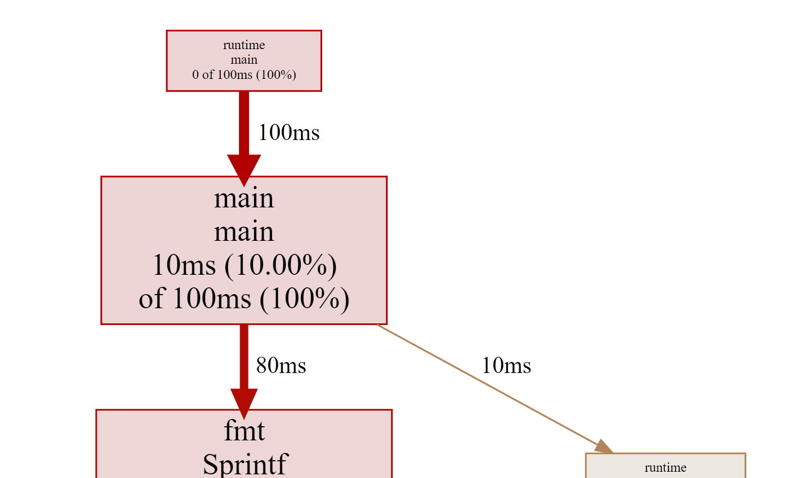

# profiling
Tried profiling in GO

Profiling is the process of collecting and analyzing the data about the performance of you code.

1. StartCPUProfile()
2. Run the program
3. StopCPUProfile()
4. Analyze: 
```go
go tool pprof -http=:8080 filename //it starts webserver on 8080
```
5. Go to localhost:8080 and be happy


